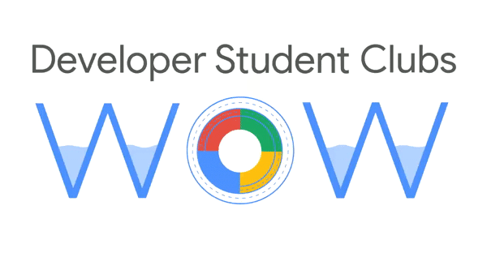

### Developer Student Clubs WOW Website

This repository contains the official website for the DSC WOW event, organized by a mega-collaboration between more than 121+ DSC's.

### Project Info

This project uses [React.Js](https://reactjs.org) and the contents are bundled using webpack.

The contents in this project follow the following structure.

```
├───public
│   └───images
│
└───src
    ├──sections
    │   ├───about
    │   ├───faq
    │   ├───footer
    │   ├───landing
    │   ├───schedule
    │   ├───speakers
    │   └───sponsors
    │
    │
    └───shared_components
        ├───button
        └───sidebar
```

Each individual section and component, follows this structure

```
section
  ├──components
  └──styles
```

#### Constants

This project uses 'Roboto' as it's primary font, with weights of 300, 400, 500 and 700. All the fonts have been pre-imported.

Moreover, here are a few constants which are used throughout the project, and have been added to the root of css, use them accordingly.

```
font-size: 16px;
--bg-primary: #ffffff;
--bg-secondary: #f5f5f5;
--text-primary: #000000;
--text-secondary: #202124;
--btn-primary: #0005df;
--btn-secondary: #ffffff;
--focused-state: #c2c3f7;
--transition-speed: 250ms;
--sidebar-width: 5rem;
```

## Setup

##### Clone the repository

```bash
git clone https://github.com/ishandeveloper/DSC-WOW.git
```

##### Move to the desired folder

```bash
cd \DSC-WOW
```

##### To install the dependencies, simply write

```bash
yarn install
```

##### To run the app, simply write

```bash
yarn start
```

### Contributors

Names will be added shortly.

## Learn More

You can learn more in the [Create React App documentation](https://facebook.github.io/create-react-app/docs/getting-started).

To learn React, check out the [React documentation](https://reactjs.org/).

[](https://github.com/ishandeveloper)
